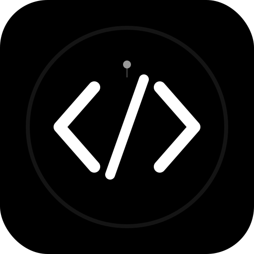
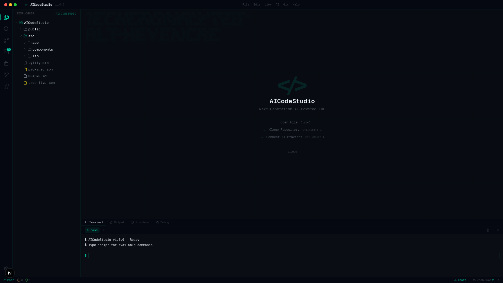
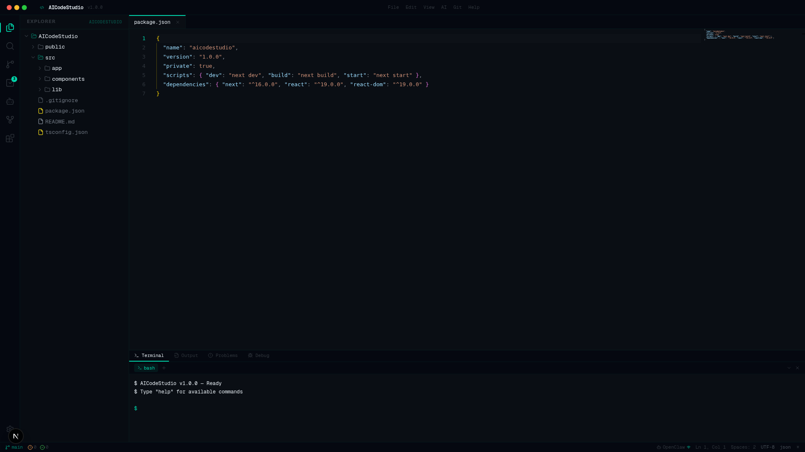
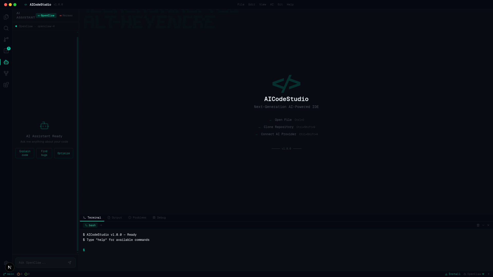
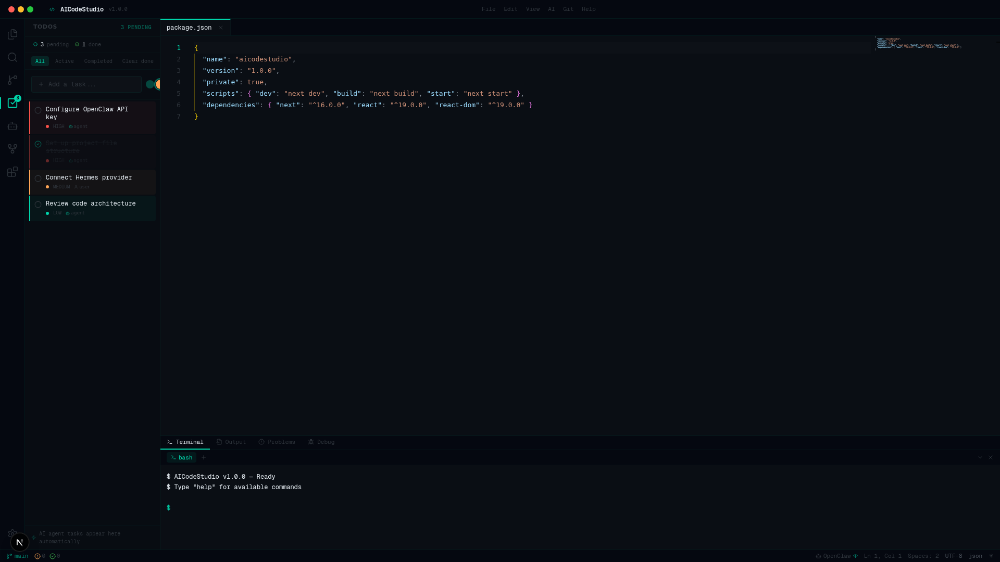
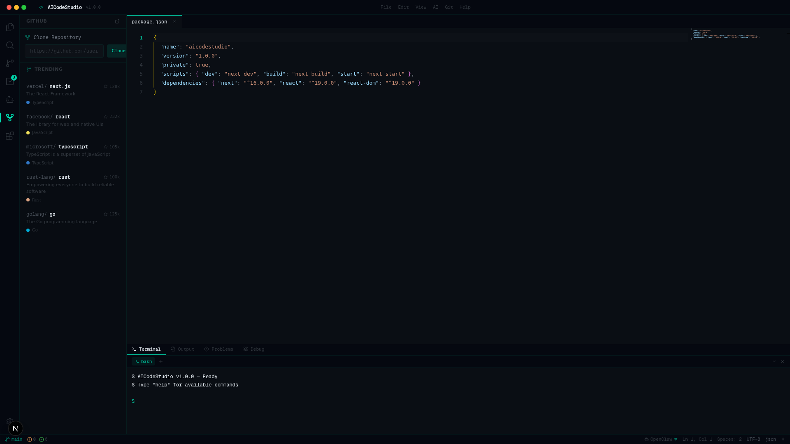

<div align="center">



# AICodeStudio

**Next-Generation AI-Powered IDE**

[](https://opensource.org/licenses/MIT)
[](https://nextjs.org/)
[](https://www.typescriptlang.org/)
[](https://react.dev/)
[](https://web.dev/progressive-web-apps/)
[](CONTRIBUTING.md)

*A free, open-source, AI-first code editor that runs in your browser. Install it as a desktop app like VSCode — no Electron required.*

[🌐 Live Demo](https://smouj.github.io/AICodeStudio) · [📥 Install](#-installation) · [✨ Features](#-features) · [🚀 Quick Start](#-quick-start) · [🤝 Contributing](#-contributing)

</div>

---



---

## ✨ Features

### 🤖 AI-Powered Development
- **OpenClaw Integration** — Connect to OpenClaw AI for intelligent code completion, refactoring, and bug detection
- **Hermes Integration** — Switch to Hermes AI for fast, focused code analysis and suggestions
- **AI Chat Panel** — Conversational AI assistant right in your sidebar; ask questions, explain code, find bugs, optimize
- **Quick Actions** — One-click AI actions: Explain Code, Find Bugs, Optimize Performance

### 📝 Professional Code Editor
- **Monaco Editor** — The same editor engine that powers VSCode
- **Syntax Highlighting** — 20+ languages with custom dark theme optimized for readability
- **IntelliSense** — Smart autocompletion, parameter hints, and code navigation
- **Bracket Pair Colorization** — Visual matching for nested code structures
- **Minimap** — Full-file code overview with slider navigation
- **Multiple Tabs** — Work with multiple files simultaneously with unsaved change indicators

### 📋 TODO System
- **Smart Task Management** — Create, organize, and track tasks with priority levels (High, Medium, Low)
- **AI Agent Tasks** — Tasks automatically appear when the AI agent suggests actions
- **Filter & Sort** — Filter by All / Active / Completed; clear completed tasks in one click
- **Visual Priority** — Color-coded borders and dots for instant priority recognition

### 🔗 GitHub Integration
- **Clone Repositories** — Paste any GitHub URL and clone directly into the IDE
- **Trending Repos** — Discover popular open-source projects without leaving the editor
- **Source Control Panel** — View changes, manage branches, and commit code

### 💻 Integrated Terminal
- **Built-in Terminal** — Full command-line interface with `bash` support
- **Custom Commands** — `help`, `ls`, `pwd`, `git status`, `echo`, `date`, `version`, `ai`, `todo`
- **Output & Problems** — Dedicated panels for output logs and error tracking
- **Debug Panel** — Start and manage debug sessions

### 📦 PWA Desktop Installation
- **Install as Desktop App** — Works like a native application on Windows, macOS, and Linux
- **Offline Support** — Service worker caching for core assets
- **Standalone Mode** — No browser chrome; full-screen IDE experience
- **App Shortcuts** — Quick access to New File, AI Assistant, and Terminal

### 🎨 Refined Design
- **Dark-First Theme** — Carefully crafted color system with `#00d4aa` accent on deep `#080c12` backgrounds
- **Minimalist UI** — Clean, distraction-free interface inspired by VSCode
- **ASCII Art Background** — Subtle animated ASCII backdrop on the welcome screen
- **Custom Scrollbars** — Thin, translucent scrollbars that match the theme
- **Grid Overlay** — Faint decorative grid lines for a futuristic aesthetic

---

## 📸 Screenshots

<table>
  <tr>
    <td align="center"><b>Code Editor</b></td>
    <td align="center"><b>AI Assistant</b></td>
  </tr>
  <tr>
    <td></td>
    <td></td>
  </tr>
  <tr>
    <td align="center"><b>TODO Panel</b></td>
    <td align="center"><b>GitHub Panel</b></td>
  </tr>
  <tr>
    <td></td>
    <td></td>
  </tr>
</table>

---

## 🚀 Quick Start

### Prerequisites
- **Node.js** 18+ or **Bun** 1.0+
- **npm**, **yarn**, **pnpm**, or **bun**

### Installation

```bash
# Clone the repository
git clone https://github.com/smouj/AICodeStudio.git
cd aicodestudio

# Install dependencies
npm install

# Start development server
npm run dev
```

Open [http://localhost:3000](http://localhost:3000) in your browser.

### Production Build

```bash
# Build for production
npm run build

# Start production server
npm start
```

### Install as Desktop App

1. Open AICodeStudio in Chrome, Edge, or any Chromium-based browser
2. Click the **install icon** in the browser address bar
3. Click **Install** — AICodeStudio will launch as a standalone desktop application
4. No Electron needed — it runs as a PWA with native-like performance

---

## 🏗️ Architecture

```
src/
├── app/
│   ├── api/              # API routes
│   ├── globals.css       # Global styles & theme variables
│   ├── layout.tsx        # Root layout with PWA metadata
│   └── page.tsx          # Main entry point
├── components/
│   └── ide/
│       ├── activity-bar.tsx      # Left icon sidebar
│       ├── ai-chat.tsx           # AI chat panel (OpenClaw/Hermes)
│       ├── bottom-panel.tsx      # Terminal/Output/Problems/Debug
│       ├── command-palette.tsx   # Ctrl+Shift+P command search
│       ├── editor-area.tsx       # Monaco Editor with custom theme
│       ├── extensions-panel.tsx  # Extension marketplace
│       ├── file-tree.tsx         # Recursive file explorer
│       ├── github-panel.tsx      # GitHub clone & trending
│       ├── git-panel.tsx         # Source control
│       ├── ide-main.tsx          # Main IDE layout orchestrator
│       ├── search-panel.tsx      # File search
│       ├── sidebar-panel.tsx     # Sidebar panel router
│       ├── status-bar.tsx        # Bottom status information
│       ├── terminal-panel.tsx    # Interactive terminal
│       └── todos-panel.tsx       # TODO task management
├── store/
│   └── ide-store.ts     # Zustand global state
└── lib/
    └── utils.ts          # Utility functions
```

---

## 🛠️ Tech Stack

| Technology | Purpose |
|---|---|
| [Next.js 16](https://nextjs.org/) | React framework with App Router |
| [React 19](https://react.dev/) | UI library with compiler |
| [TypeScript 5](https://www.typescriptlang.org/) | Type-safe development |
| [Monaco Editor](https://microsoft.github.io/monaco-editor/) | VSCode's editor engine |
| [Zustand](https://zustand.docs.pmnd.rs/) | Lightweight state management |
| [Tailwind CSS 4](https://tailwindcss.com/) | Utility-first styling |
| [shadcn/ui](https://ui.shadcn.com/) | Accessible UI components |
| [Lucide Icons](https://lucide.dev/) | Beautiful icon set |
| [PWA](https://web.dev/progressive-web-apps/) | Desktop installation support |

---

## ⌨️ Keyboard Shortcuts

| Shortcut | Action |
|---|---|
| `Ctrl+Shift+P` | Open Command Palette |
| `Ctrl+Shift+F` | Search in Files |
| `Ctrl+Shift+G` | Source Control |
| `Ctrl+Shift+A` | AI Assistant |
| `Ctrl+Shift+X` | Extensions |
| `Ctrl+\`` | Toggle Terminal |
| `Ctrl+,` | Open Settings |
| `Ctrl+T` | Toggle Theme |

---

## 🎯 Roadmap

- [ ] Real file system access via File System Access API
- [ ] Live collaborative editing (CRDT-based)
- [ ] Extension marketplace with community plugins
- [ ] Real terminal integration (PTY over WebSocket)
- [ ] Language Server Protocol support
- [ ] Docker container management
- [ ] Database viewer and editor
- [ ] Git operations (push, pull, merge, rebase)
- [ ] Custom themes marketplace
- [ ] Voice-to-code AI integration

---

## 🤝 Contributing

Contributions are welcome! Please feel free to submit a Pull Request.

1. **Fork** the repository
2. **Create** your feature branch (`git checkout -b feature/amazing-feature`)
3. **Commit** your changes (`git commit -m 'Add amazing feature'`)
4. **Push** to the branch (`git push origin feature/amazing-feature`)
5. **Open** a Pull Request

---

## 📄 License

This project is licensed under the MIT License — see the [LICENSE](LICENSE) file for details.

---

<div align="center">

**Built with ❤️ by the AICodeStudio Team**

[⬆ Back to Top](#aicodestudio)

</div>
