<div align="center">


# AICodeStudio

**Next-Generation AI-Powered IDE**

[](https://opensource.org/licenses/MIT)
[](https://nextjs.org/)
[](https://www.typescriptlang.org/)
[](https://react.dev/)
[](https://web.dev/progressive-web-apps/)
[](CONTRIBUTING.md)

*A free, open-source, AI-first code editor that runs in your browser. Install it as a desktop app like VSCode — no Electron required.*

[🌐 Live Demo](https://smouj.github.io/AICodeStudio) · [📥 Install](#-installation) · [✨ Features](#-features) · [🚀 Quick Start](#-quick-start) · [🤝 Contributing](#-contributing)

</div>

---

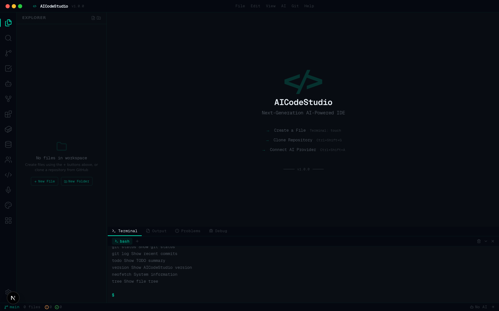

---

## ✨ Features

### 🤖 AI-Powered Development
- **User-Configurable AI Providers** — Add any AI provider with your own API key; keys are sent only to your AICodeStudio instance and are not persisted by default
- **Real AI Chat** — Direct API integration with real AI models through configurable endpoints; no simulated responses or canned fallbacks
- **Connection Testing** — Test your AI provider connection before saving to verify everything works
- **Quick Actions** — One-click AI actions: Explain Code, Find Bugs, Optimize Performance
- **Markdown Rendering** — AI responses render with full Markdown formatting including code blocks

### 🎤 Voice-to-Code
- **Voice Commands** — Speak natural language commands to create functions, add imports, explain code, find bugs, and refactor
- **Real-Time Transcription** — Live speech-to-text using the Web Speech API with visual waveform feedback
- **Multi-Language Support** — Voice recognition in English, Spanish, French, German, Chinese, and Japanese
- **AI Code Suggestions** — Voice commands trigger AI-powered code suggestions with one-click apply

### 📝 Professional Code Editor
- **Monaco Editor** — The same editor engine that powers VSCode with IntelliSense, bracket matching, and code folding
- **Configurable Settings** — Font size, tab size, minimap, word wrap, line numbers, ligatures, bracket pairs — all adjustable in real-time
- **Syntax Highlighting** — 20+ languages with custom dark theme optimized for readability
- **Multiple Tabs** — Work with multiple files simultaneously with unsaved change indicators and auto-save
- **Breadcrumbs** — Navigation path bar showing file location
- **Error Boundary** — Graceful error handling with recovery UI if the editor encounters issues

### 📂 Virtual File System
- **Create Files & Folders** — Build your workspace from scratch with real file operations
- **Rename & Delete** — Full file management with inline rename and delete confirmation
- **Real File Contents** — Every file stores real content; no placeholders or fake data
- **Auto-Save** — Changes are automatically persisted to the virtual file system

### 🐳 Docker Container Management
- **Container Operations** — Start, stop, restart, and remove Docker containers directly from the IDE
- **Image Management** — Pull and list Docker images
- **Security-First** — Docker is disabled by default; requires `AICODE_ENABLE_DOCKER=true` and `DOCKER_HOST` to be explicitly set
- **Status Indicators** — Clear UI indication when Docker is unavailable or disabled

### 🗄️ Database Viewer & Editor
- **SQLite Support** — Connect to SQLite databases with full schema browsing and query execution
- **Connection Manager** — Save and manage database connections
- **Schema Explorer** — Browse tables, columns, data types, and constraints
- **SQL Query Editor** — Write and execute SQL queries with Ctrl+Enter, view results in a formatted table
- **Read-Only by Default** — Only SELECT/WITH/PRAGMA/EXPLAIN are allowed unless `AICODE_DB_WRITE_ENABLED=true`
- **Other Databases** — PostgreSQL, MySQL, MongoDB, Redis, MSSQL support is planned (coming soon)

### 👥 Collaborative Editing (Simulated)
- **Room Management** — Create and join collaboration rooms
- **Participant Tracking** — See connected peers with cursor colors
- **Experimental** — Real-time sync requires a WebSocket server; currently uses in-memory state

### 🔍 Real Search
- **Search in Files** — Searches through actual file contents in your workspace
- **Regex Support** — Use regular expressions for advanced pattern matching
- **Case Sensitive / Whole Word** — Toggle search options for precise results
- **Click to Navigate** — Click any result to open the file at that line

### 🔗 GitHub Integration
- **Clone Repositories** — Clone any public GitHub repo via the API; files are loaded into your workspace
- **Search GitHub** — Search repositories directly using the GitHub Search API
- **Trending Repos** — Fetch trending repositories from the last month via the GitHub API
- **GitHub Token Support** — Add a personal access token for higher rate limits and private repo access

### 📊 Advanced Git Operations
- **Full Change Tracking** — Stage/unstage individual files, discard changes, view diffs with inline or split view
- **Commit Workflow** — Write commit messages with templates, signed-off-by, and amend support
- **Branch Management** — Create, switch, and delete branches
- **Push & Pull** — Push to remote, pull with rebase/merge options, and force-pull support
- **Merge & Rebase** — Merge branches with conflict indicators, rebase onto target branches
- **Commit History** — Browse commit log with SHA, author, date, and message

### 💻 Integrated Terminal
- **Virtual Terminal** — `touch`, `mkdir`, `rm`, `mv`, `cat` operate on the virtual file system
- **Directory Navigation** — `cd`, `pwd`, `ls`, `tree` work with the folder structure
- **Command History** — Arrow up/down to navigate previous commands
- **Neofetch** — System info display with `neofetch` command
- **Real PTY** — Available when `AICODE_ENABLE_TERMINAL=true` with node-pty installed (requires server mode)

### 🔧 Language Server Protocol (Simulated)
- **Multi-Language Support** — 10 language configurations: TypeScript, JavaScript, Python, Rust, Go, Java, C/C++, HTML, CSS, JSON
- **Start/Stop Servers** — Manage language server instances with status indicators
- **Simulated Diagnostics & Completions** — Basic syntax-aware suggestions and diagnostics
- **Real LSP** — Available when `AICODE_ENABLE_LSP=true` with language servers installed (requires server mode)

### 🧩 Extension Marketplace
- **Open VSX Registry** — Browse and install extensions from the Open VSX Registry
- **Search & Categories** — Search by name, filter by category (AI, Git, Editor, DevOps, Theme, Language)
- **Install/Uninstall/Toggle** — Full extension lifecycle management with progress indicators
- **Extension Details** — View README, changelog, and version information before installing

### 🎨 Custom Themes Marketplace
- **Pre-Built Themes** — Nord, Dracula, GitHub Dark, Solarized, Monokai, and Rosé Pine with full color definitions
- **Theme Builder** — Create custom themes with color pickers for editor, sidebar, terminal, and syntax highlighting
- **Live Preview** — See your custom theme applied to code in real-time as you build it
- **Install/Uninstall** — Manage your installed themes with one-click apply

### 🗺️ Canvas Navigation
- **Visual File Graph** — Interactive canvas-based visualization of your workspace files and dependencies
- **3 Layout Modes** — Tree, Grid, and Force-directed layouts for different perspectives
- **Pan & Zoom** — Navigate the canvas with mouse drag and scroll wheel
- **Minimap** — Overview minimap for quick navigation across large workspaces
- **Git Status Overlay** — Color-coded file nodes showing modified, added, and untracked status
- **Search & Filter** — Find files on the canvas by name

### 📋 TODO System
- **Smart Task Management** — Create, organize, and track tasks with priority levels (High, Medium, Low)
- **AI Agent Tasks** — Tasks automatically appear when the AI agent suggests actions
- **Filter & Sort** — Filter by All / Active / Completed; clear completed tasks in one click
- **Visual Priority** — Color-coded borders and dots for instant priority recognition

### ⚙️ Settings
- **Real-Time Editor Settings** — Font size, tab size, minimap, word wrap, line numbers, ligatures, bracket pairs, theme
- **Applied Immediately** — Changes take effect in the editor instantly
- **Reset to Defaults** — One-click reset to default settings

### 📦 PWA Desktop Installation
- **Install as Desktop App** — Works like a native application on Windows, macOS, and Linux
- **Offline Support** — Service worker caching for core assets
- **Standalone Mode** — No browser chrome; full-screen IDE experience
- **App Shortcuts** — Quick access to New File, AI Assistant, and Terminal

### 🎨 Refined Design
- **Dark-First Theme** — Carefully crafted color system with `#00d4aa` teal accent on deep `#080c12` backgrounds
- **Minimalist UI** — Clean, distraction-free interface inspired by VSCode
- **ASCII Art Background** — Subtle animated ASCII backdrop on the welcome screen
- **Custom Scrollbars** — Thin, translucent scrollbars that match the theme
- **Grid Overlay** — Faint decorative grid lines for a futuristic aesthetic
- **Resizable Panels** — Drag to resize sidebar and bottom panel widths
- **Notification Toasts** — Non-intrusive toast notifications for operations
- **Accessibility** — Skip-to-content link, ARIA labels, keyboard navigation

---

## 📸 Screenshots

<table>
  <tr>
    <td align="center"><b>Full IDE</b></td>
    <td align="center"><b>File Explorer</b></td>
  </tr>
  <tr>
    <td></td>
    <td>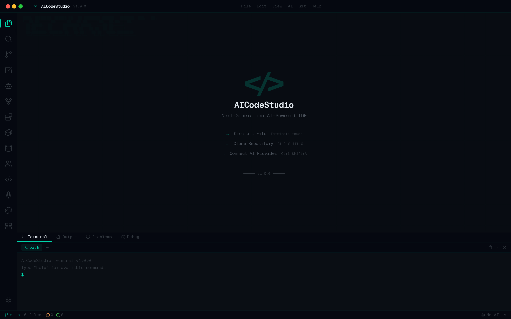</td>
  </tr>
  <tr>
    <td align="center"><b>Search in Files</b></td>
    <td align="center"><b>Source Control</b></td>
  </tr>
  <tr>
    <td>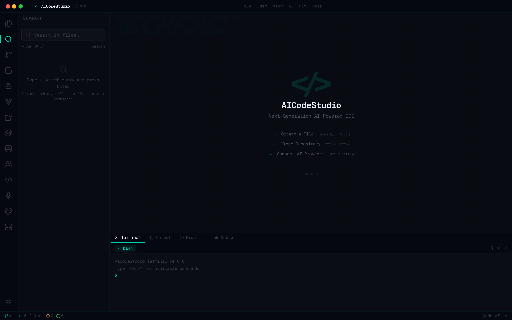</td>
    <td>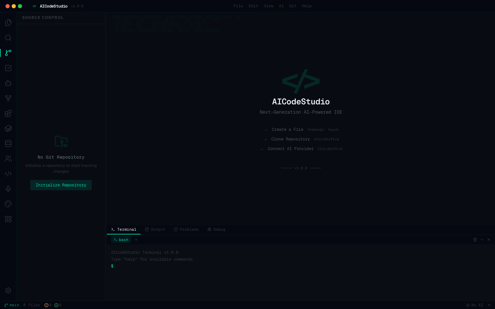</td>
  </tr>
  <tr>
    <td align="center"><b>AI Assistant</b></td>
    <td align="center"><b>TODO Panel</b></td>
  </tr>
  <tr>
    <td>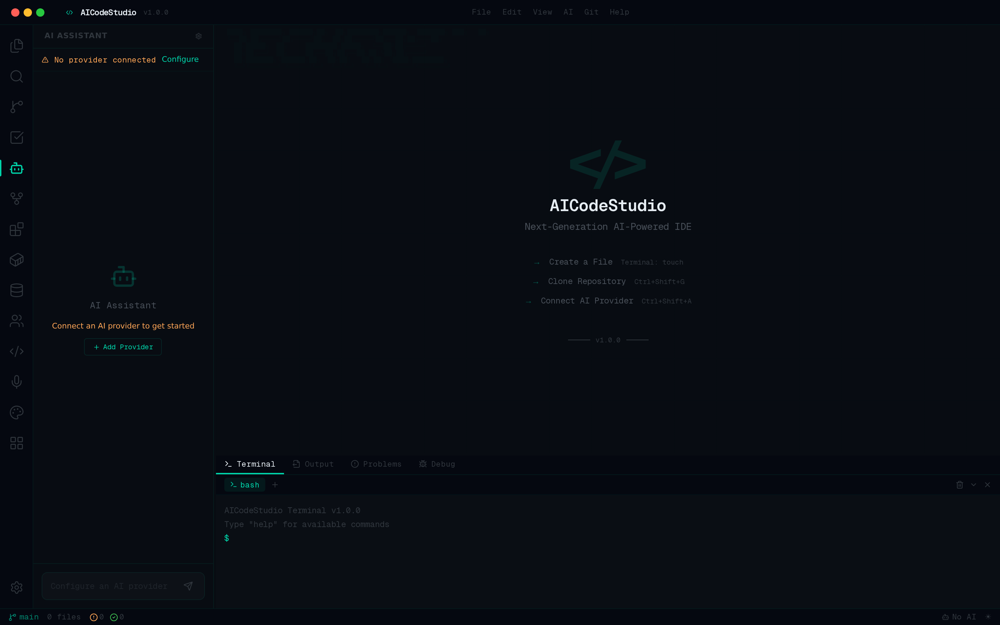</td>
    <td>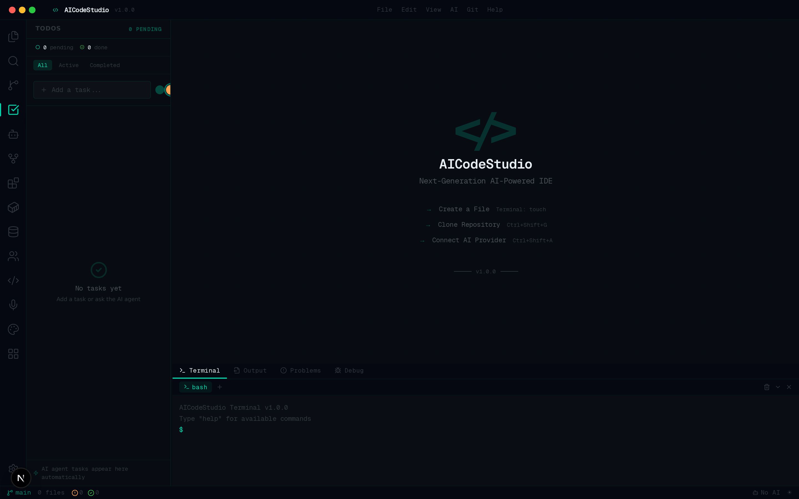</td>
  </tr>
  <tr>
    <td align="center"><b>GitHub Integration</b></td>
    <td align="center"><b>Extensions</b></td>
  </tr>
  <tr>
    <td>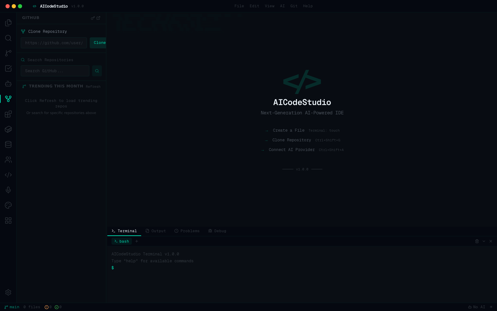</td>
    <td>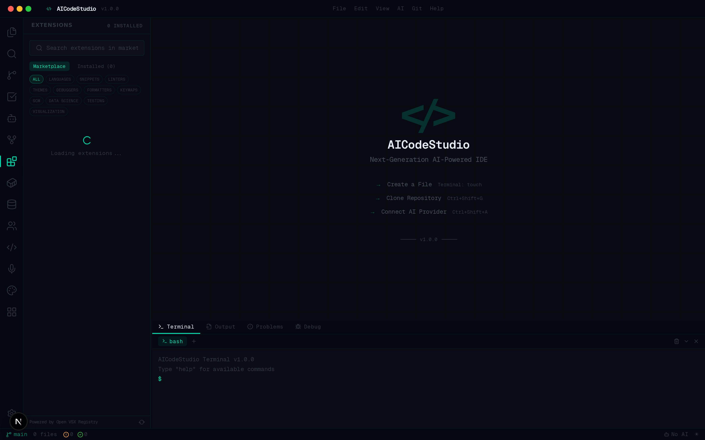</td>
  </tr>
  <tr>
    <td align="center"><b>Docker Management</b></td>
    <td align="center"><b>Database Viewer</b></td>
  </tr>
  <tr>
    <td>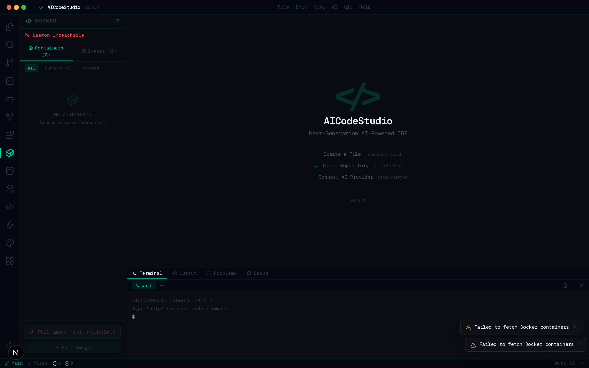</td>
    <td>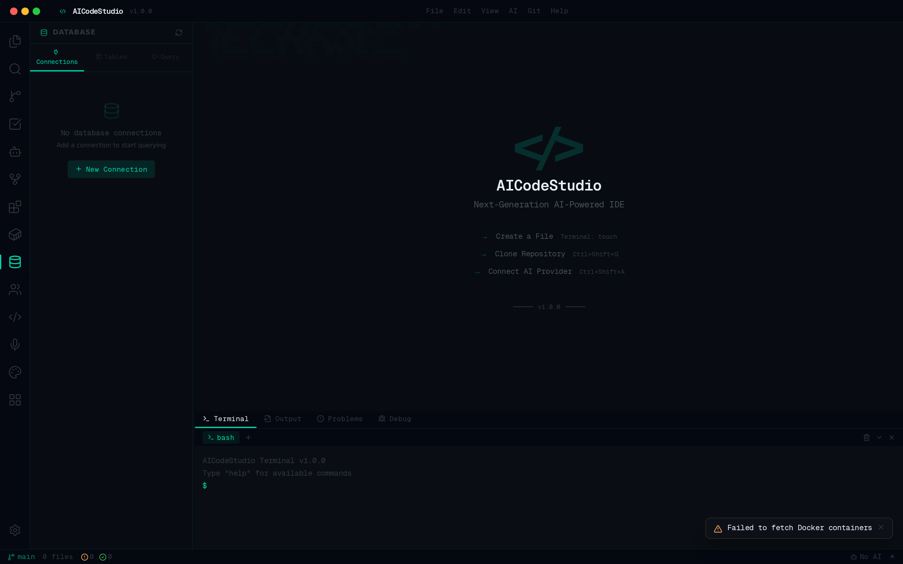</td>
  </tr>
  <tr>
    <td align="center"><b>Collaboration</b></td>
    <td align="center"><b>Language Servers</b></td>
  </tr>
  <tr>
    <td>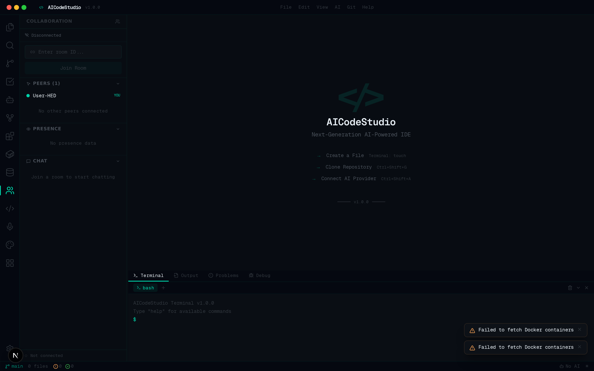</td>
    <td>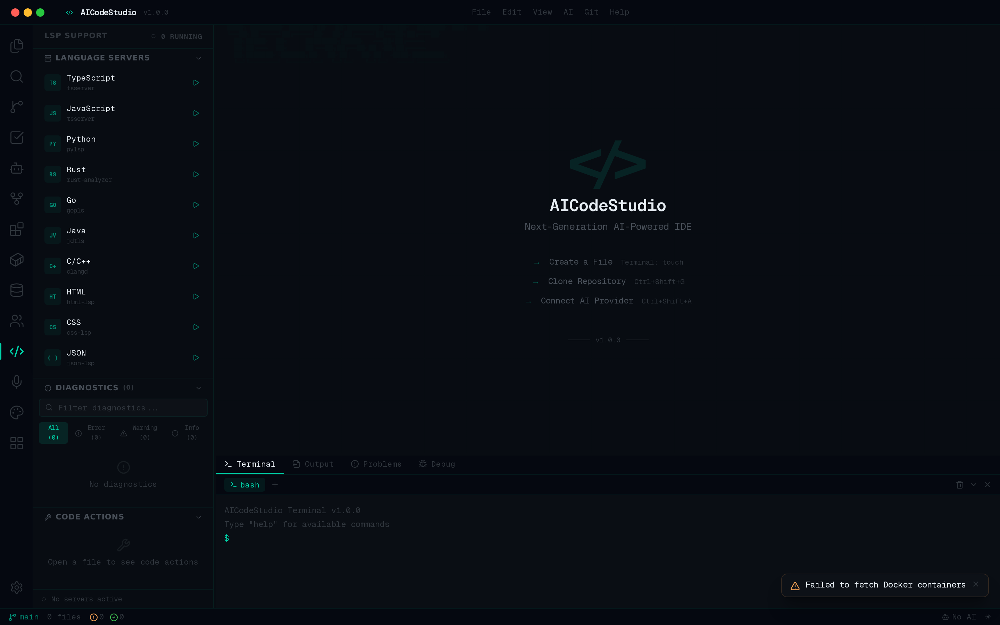</td>
  </tr>
  <tr>
    <td align="center"><b>Voice-to-Code</b></td>
    <td align="center"><b>Themes Marketplace</b></td>
  </tr>
  <tr>
    <td>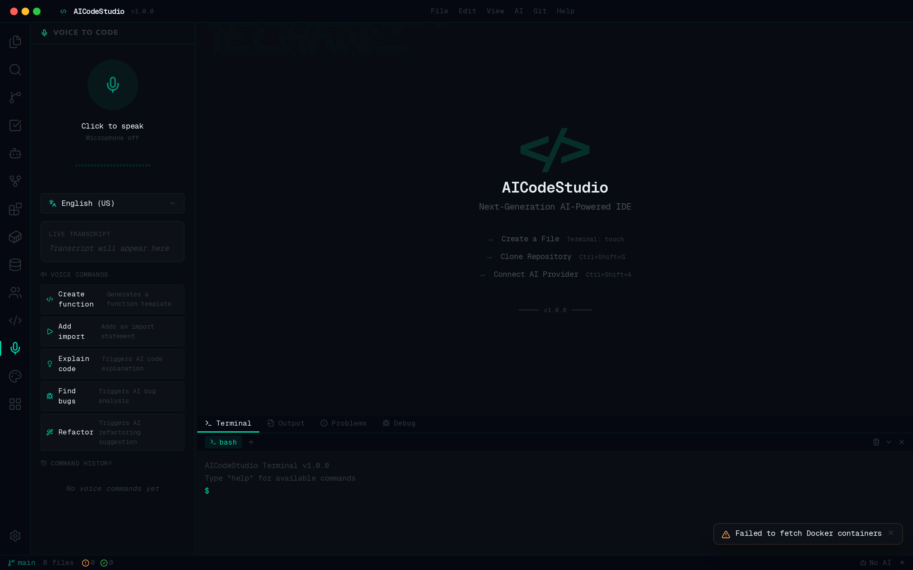</td>
    <td>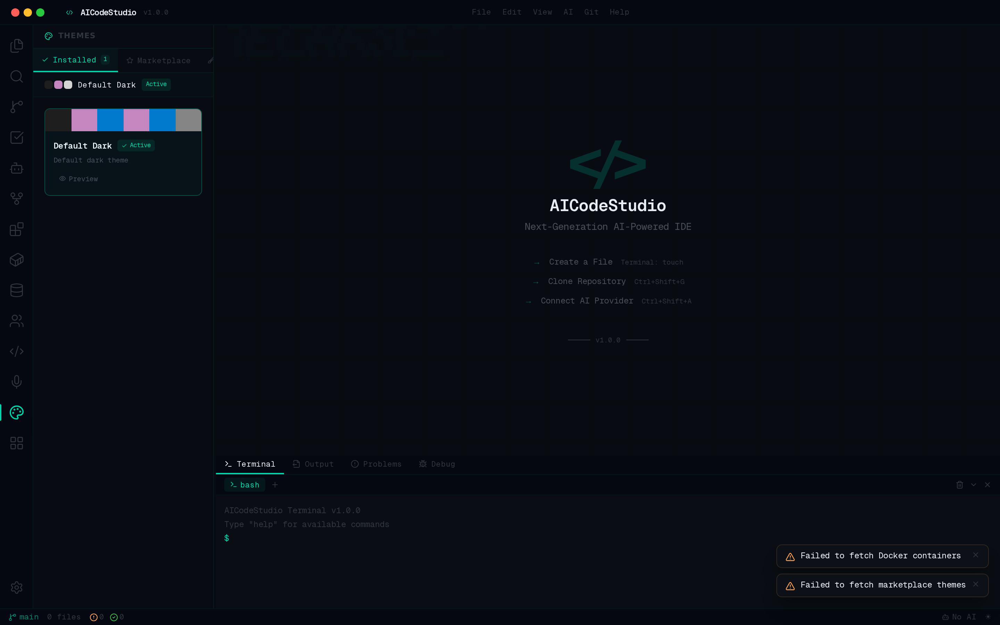</td>
  </tr>
  <tr>
    <td align="center"><b>Canvas Navigation</b></td>
    <td align="center"><b>Command Palette</b></td>
  </tr>
  <tr>
    <td>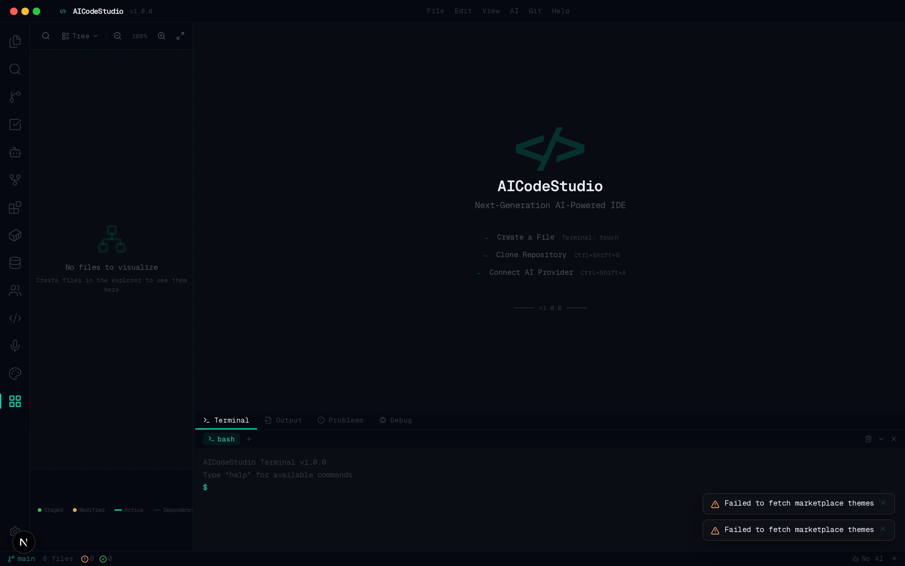</td>
    <td>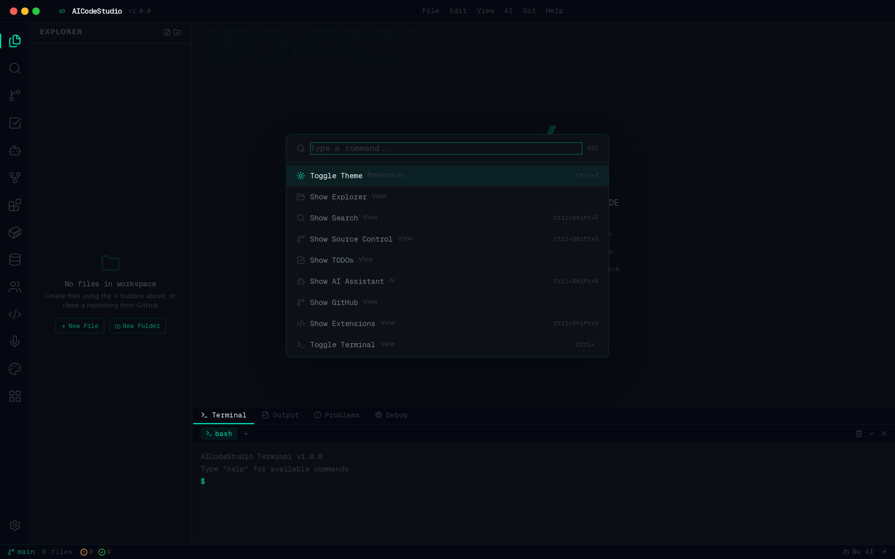</td>
  </tr>
</table>

---

## 🚀 Quick Start

### Prerequisites
- **Node.js** 18+ or **Bun** 1.0+
- **npm**, **yarn**, **pnpm**, or **bun**

### Installation

```bash
# Clone the repository
git clone https://github.com/smouj/AICodeStudio.git
cd AICodeStudio

# Install dependencies
npm install

# Start development server
npm run dev
```

Open [http://localhost:3000](http://localhost:3000) in your browser.

### Production Build

AICodeStudio supports two deployment modes:

```bash
# Server mode (full IDE with APIs)
npm run build:server
npm start

# Static demo mode (GitHub Pages)
npm run build:static
# Output in out/ directory
```

See [DEPLOYMENT.md](DEPLOYMENT.md) for detailed deployment instructions.

### Install as Desktop App

1. Open AICodeStudio in Chrome, Edge, or any Chromium-based browser
2. Click the **install icon** in the browser address bar
3. Click **Install** — AICodeStudio will launch as a standalone desktop application
4. No Electron needed — it runs as a PWA with native-like performance

---

## 🏗️ Architecture

```
src/
├── app/
│   ├── api/
│   │   ├── ai/route.ts              # AI chat endpoint
│   │   ├── capabilities/route.ts    # Server capability status
│   │   ├── collaboration/route.ts   # Collaboration room management
│   │   ├── database/route.ts        # SQLite connections & queries
│   │   ├── docker/route.ts          # Docker container management
│   │   ├── extensions/route.ts      # Extension marketplace API
│   │   ├── git/route.ts             # Git operations (sandboxed)
│   │   ├── lsp/route.ts             # Language Server Protocol
│   │   ├── terminal/route.ts        # Terminal session management
│   │   ├── themes/route.ts          # Theme marketplace API
│   │   └── voice/route.ts           # Voice-to-code processing
│   ├── globals.css                   # Global styles & theme variables
│   ├── layout.tsx                    # Root layout with PWA metadata
│   └── page.tsx                      # Main entry point
├── components/
│   ├── ide/
│   │   ├── activity-bar.tsx          # Left icon sidebar
│   │   ├── ai-chat.tsx              # AI chat with provider config
│   │   ├── bottom-panel.tsx         # Terminal/Output/Problems/Debug
│   │   ├── canvas-navigation.tsx    # Visual file graph canvas
│   │   ├── collaboration-panel.tsx  # Collaboration rooms
│   │   ├── command-palette.tsx      # Ctrl+Shift+P command search
│   │   ├── database-panel.tsx       # Database viewer & query editor
│   │   ├── docker-panel.tsx         # Docker container management
│   │   ├── editor-area.tsx          # Monaco Editor with settings
│   │   ├── extensions-marketplace.tsx # Open VSX marketplace
│   │   ├── file-tree.tsx            # Recursive file explorer
│   │   ├── git-panel.tsx            # Source control with staging
│   │   ├── ide-main.tsx             # Main IDE layout orchestrator
│   │   ├── lsp-panel.tsx            # Language Server Protocol
│   │   ├── runtime-status.tsx       # Server capability indicators
│   │   ├── search-panel.tsx         # File content search
│   │   ├── settings-panel.tsx       # Editor preferences + runtime status
│   │   ├── terminal-panel.tsx       # Terminal with FS commands
│   │   └── ...                      # More IDE components
│   └── ui/                           # shadcn/ui component library
├── store/
│   ├── ide-store.ts                  # Re-exports from enhanced store
│   └── ide-store-enhanced.ts         # Zustand global state (secrets NOT persisted)
├── lib/
│   ├── security/
│   │   ├── path-sandbox.ts           # Path traversal protection
│   │   └── sql-guard.ts              # SQL query restriction
│   ├── server-flags/
│   │   └── index.ts                  # Feature flag capability system
│   ├── db.ts                         # Prisma client
│   ├── version.ts                    # App version (single source of truth)
│   └── utils.ts                      # Utility functions
└── ...
```

---

## 🛠️ Tech Stack

| Technology | Purpose |
|---|---|
| [Next.js 16](https://nextjs.org/) | React framework with App Router |
| [React 19](https://react.dev/) | UI library with compiler |
| [TypeScript 5](https://www.typescriptlang.org/) | Type-safe development |
| [Monaco Editor](https://microsoft.github.io/monaco-editor/) | VSCode's editor engine |
| [Zustand](https://zustand.docs.pmnd.rs/) | Lightweight state management |
| [Tailwind CSS 4](https://tailwindcss.com/) | Utility-first styling |
| [shadcn/ui](https://ui.shadcn.com/) | Accessible UI components |
| [Lucide Icons](https://lucide.dev/) | Beautiful icon set |
| [Yjs](https://yjs.dev/) | CRDT-based real-time collaboration |
| [Open VSX](https://open-vsx.org/) | Extension marketplace registry |
| [PWA](https://web.dev/progressive-web-apps/) | Desktop installation support |
| [Prisma](https://www.prisma.io/) | Database ORM |
| [isomorphic-git](https://isomorphic-git.org/) | Browser Git operations |

---

## ⌨️ Keyboard Shortcuts

| Shortcut | Action |
|---|---|
| `Ctrl+Shift+P` | Open Command Palette |
| `Ctrl+Shift+F` | Search in Files |
| `Ctrl+Shift+G` | Source Control |
| `Ctrl+Shift+A` | AI Assistant |
| `Ctrl+Shift+X` | Extensions |
| `Ctrl+\`` | Toggle Terminal |
| `Ctrl+,` | Open Settings |
| `Ctrl+T` | Toggle Theme |
| `Ctrl+Enter` | Execute Query (Database) |

---

## 🎯 Roadmap

- [x] Virtual file system with real file operations
- [x] Real search across file contents
- [x] User-configurable AI providers with real API calls
- [x] GitHub API integration for clone/search/trending
- [x] Git staging and commit workflow (server mode)
- [x] Virtual terminal with file system commands
- [x] Configurable editor settings
- [x] Extension marketplace (Open VSX)
- [x] Docker container management (requires explicit opt-in)
- [x] SQLite database viewer and query editor
- [x] Language Server Protocol (simulated; real LSP behind flag)
- [x] Custom themes marketplace with theme builder
- [x] Voice-to-code AI integration
- [x] Canvas navigation for visual file graphs
- [x] PWA desktop installation
- [x] Security hardening (path sandboxing, SQL guard, secret protection)
- [ ] File System Access API for local files
- [ ] Real PTY terminal over WebSocket
- [ ] Canvas-based real-time collaborative whiteboard
- [ ] Real-time collaboration via WebSocket (Yjs)
- [ ] Real LSP integration for TypeScript/JavaScript
- [ ] Multi-database adapters (PostgreSQL, MySQL, MongoDB)

---

## 📊 Feature Status

| Feature | Static Demo | Server Mode | Status |
|---------|:-----------:|:-----------:|--------|
| Monaco Editor | Yes | Yes | Real |
| Virtual FS | Yes | Yes | Real |
| AI Chat | If provider set | Yes | Real if provider configured |
| Search in Files | Yes | Yes | Real |
| Extensions | Yes | Yes | Real (Open VSX) |
| Themes | Yes | Yes | Real |
| Docker | No | Optional | Protected by flag |
| Terminal PTY | Virtual only | Optional | Real if `AICODE_ENABLE_TERMINAL=true` |
| LSP | Simulated | Optional | Simulated by default; real if `AICODE_ENABLE_LSP=true` |
| Database | No | SQLite only | Read-only by default |
| Collaboration | No | Simulated | In-memory rooms only |
| Git (server) | No | Yes | Sandboxed to WORKSPACE_DIR |
| File System Access | Yes | Yes | Browser API (when supported) |
| PWA Install | Yes | Yes | Real |

---

## 🤝 Contributing

Contributions are welcome! Please feel free to submit a Pull Request.

1. **Fork** the repository
2. **Create** your feature branch (`git checkout -b feature/amazing-feature`)
3. **Commit** your changes (`git commit -m 'Add amazing feature'`)
4. **Push** to the branch (`git push origin feature/amazing-feature`)
5. **Open** a Pull Request

See [CONTRIBUTING.md](CONTRIBUTING.md) for detailed guidelines.

---

## 📄 License

This project is licensed under the MIT License — see the [LICENSE](LICENSE) file for details.

---

<div align="center">

**Built with care by the AICodeStudio Team**

[⬆ Back to Top](#aicodestudio)

</div>
