<div align="center">

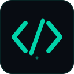

# AICodeStudio

**AI-native workspace for code agents**

[](https://opensource.org/licenses/MIT)
[](https://nextjs.org/)
[](https://www.typescriptlang.org/)
[](https://react.dev/)
[](https://web.dev/progressive-web-apps/)
[](CONTRIBUTING.md)

*An open-source, AI-first code editor that runs in your browser. Install it as a desktop app — no Electron required.*

[🌐 Live Demo](https://smouj.github.io/AICodeStudio) · [📥 Install](#-installation) · [✨ Features](#-features) · [🚀 Quick Start](#-quick-start) · [🤝 Contributing](#-contributing)

</div>

---

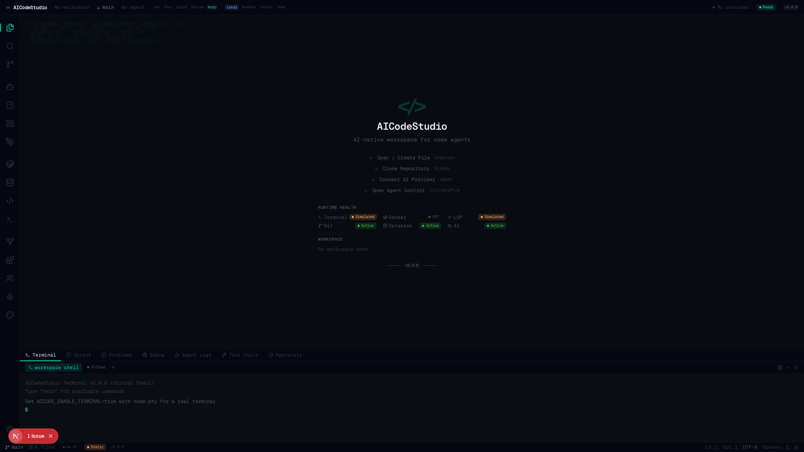

---

## Screenshots

*All screenshots are captured from the real running application — no mockups or AI-generated images.*

<table>
  <tr>
    <td align="center"><b>Agent Control Panel</b></td>
    <td align="center"><b>Editor + Terminal</b></td>
  </tr>
  <tr>
    <td>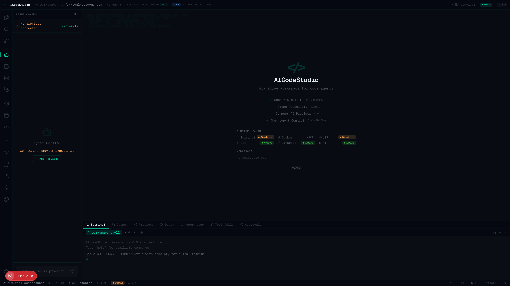</td>
    <td>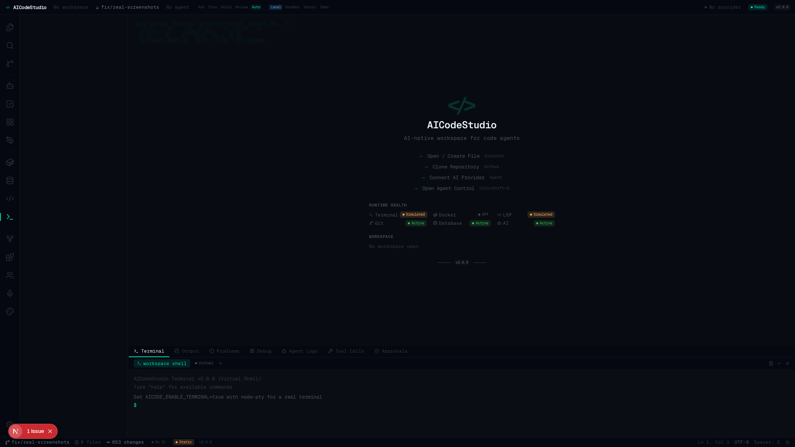</td>
  </tr>
  <tr>
    <td align="center"><b>File Explorer</b></td>
    <td align="center"><b>Search in Files</b></td>
  </tr>
  <tr>
    <td>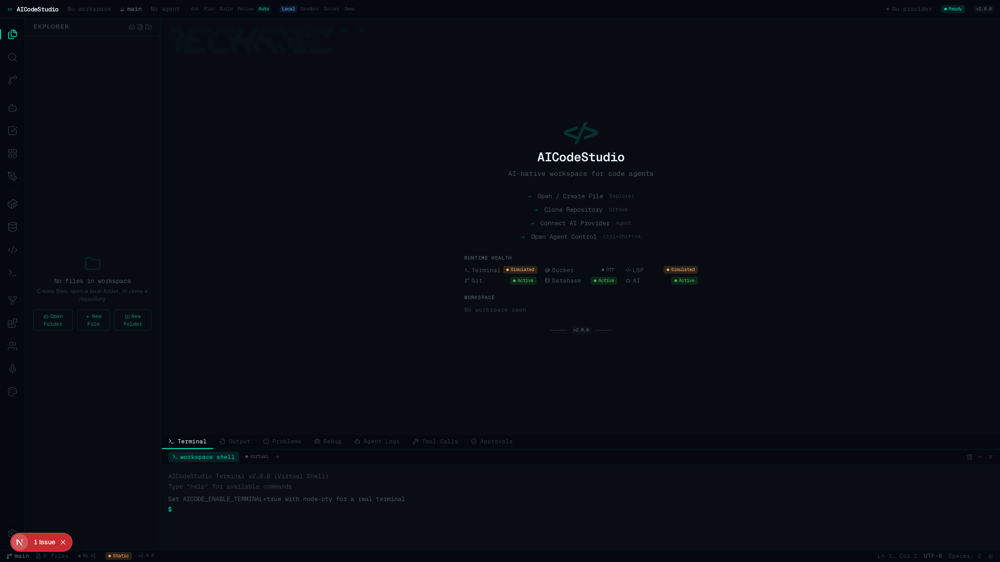</td>
    <td>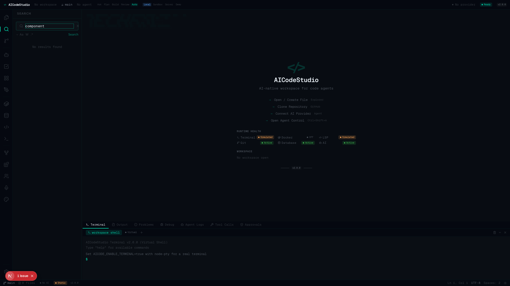</td>
  </tr>
  <tr>
    <td align="center"><b>Source Control</b></td>
    <td align="center"><b>GitHub Integration</b></td>
  </tr>
  <tr>
    <td>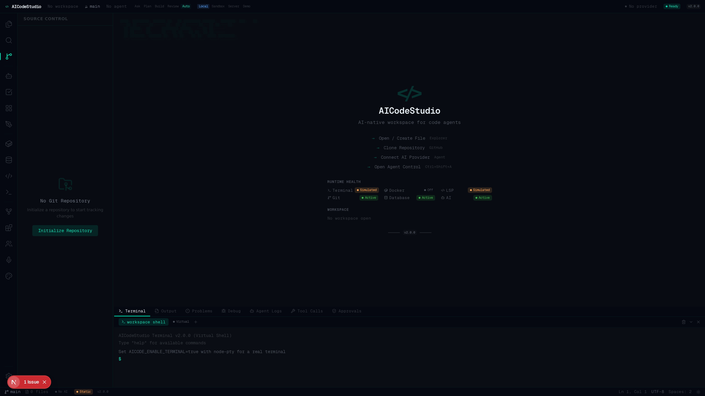</td>
    <td>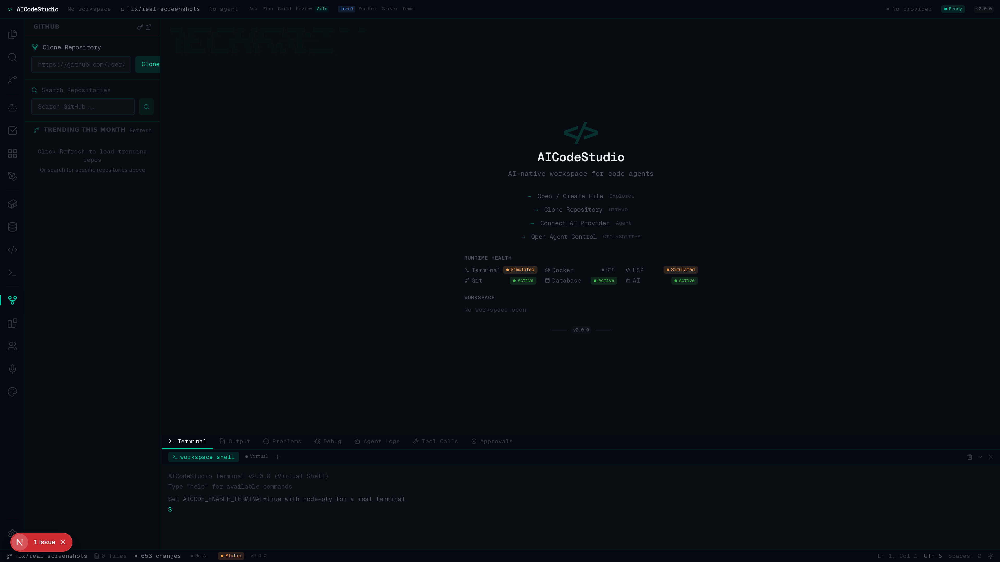</td>
  </tr>
  <tr>
    <td align="center"><b>Extensions Marketplace</b></td>
    <td align="center"><b>Themes Marketplace</b></td>
  </tr>
  <tr>
    <td>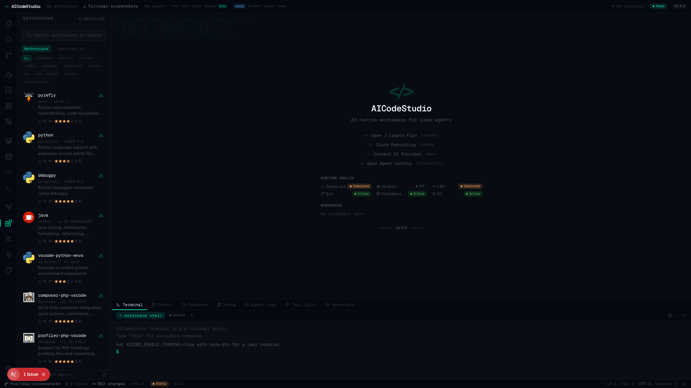</td>
    <td>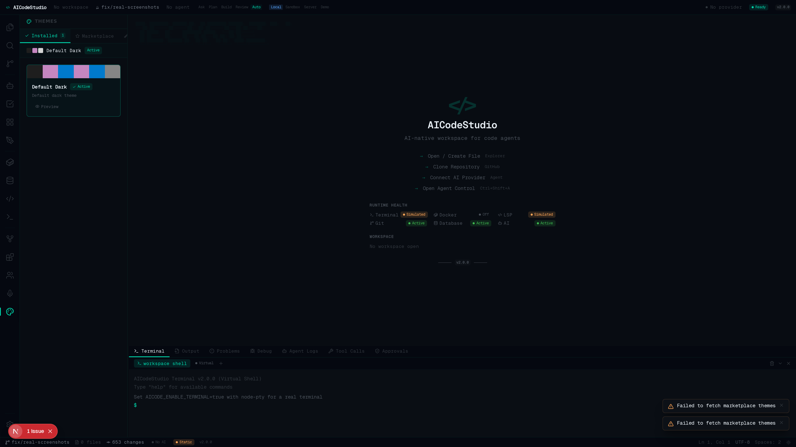</td>
  </tr>
  <tr>
    <td align="center"><b>Docker Management</b></td>
    <td align="center"><b>Database Viewer</b></td>
  </tr>
  <tr>
    <td></td>
    <td>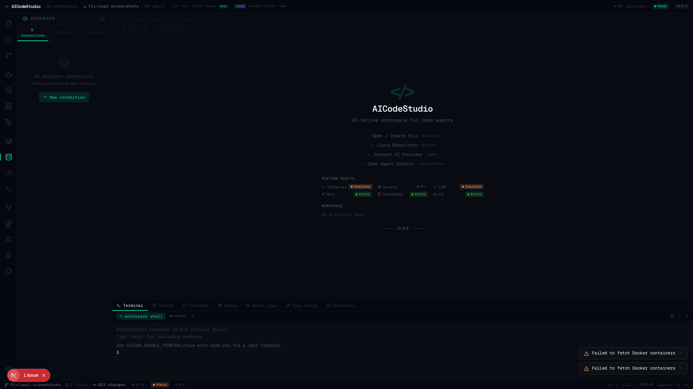</td>
  </tr>
  <tr>
    <td align="center"><b>Language Servers</b></td>
    <td align="center"><b>Runtime Status / Settings</b></td>
  </tr>
  <tr>
    <td>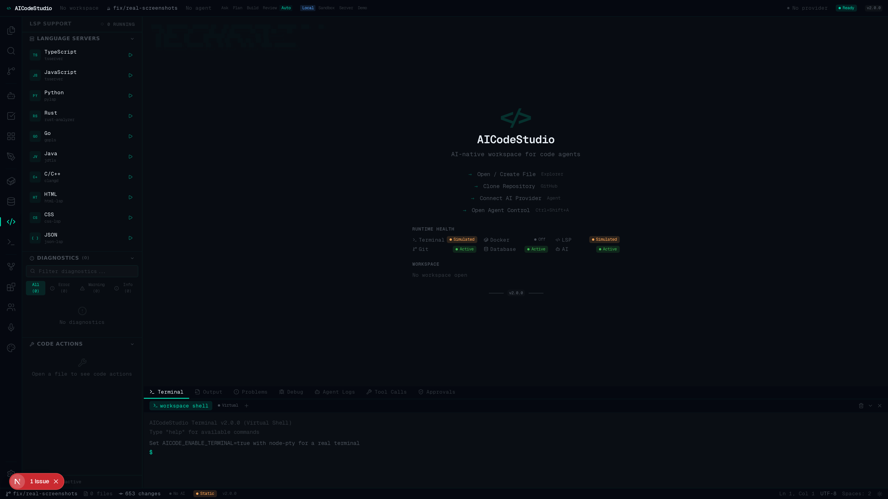</td>
    <td>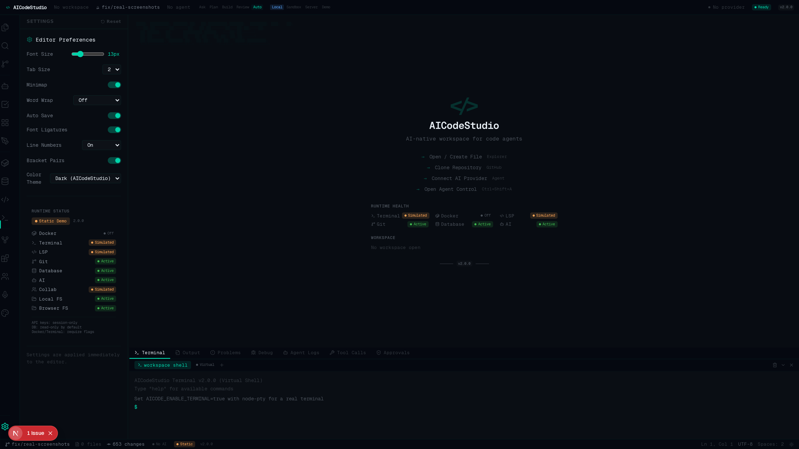</td>
  </tr>
  <tr>
    <td align="center"><b>Canvas Navigation</b></td>
    <td align="center"><b>Command Palette</b></td>
  </tr>
  <tr>
    <td>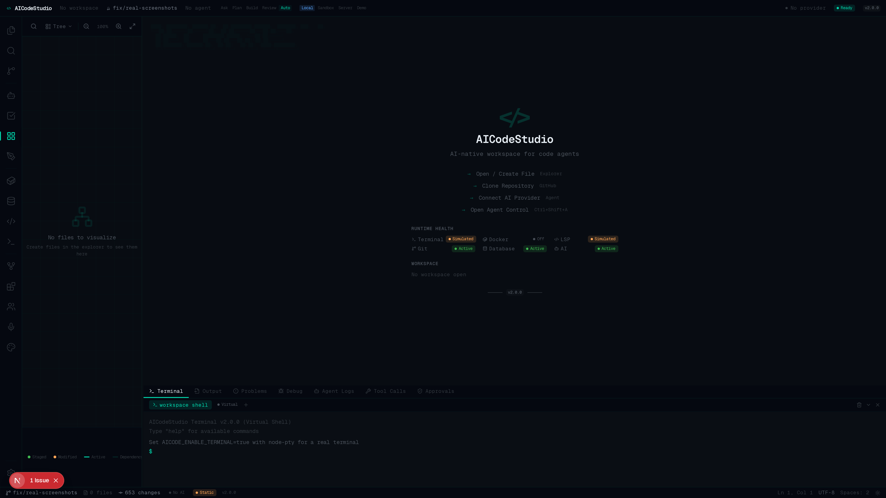</td>
    <td>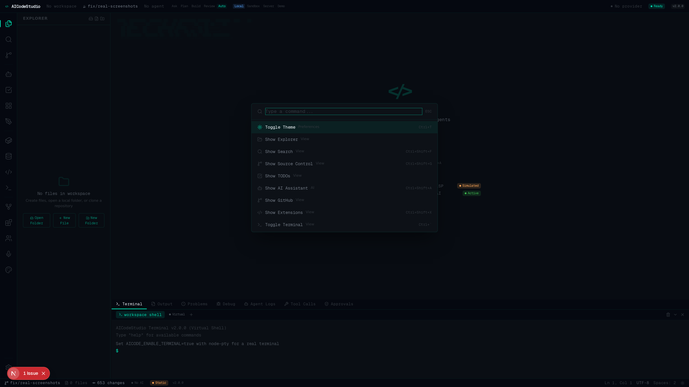</td>
  </tr>
  <tr>
    <td align="center"><b>Collaboration</b></td>
    <td align="center"><b>TODOs</b></td>
  </tr>
  <tr>
    <td>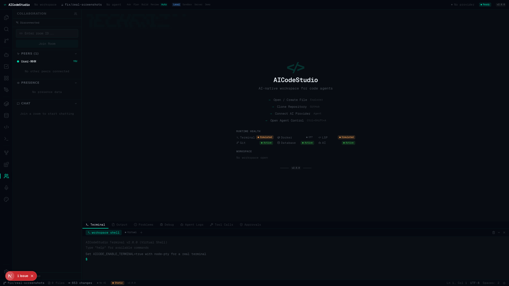</td>
    <td>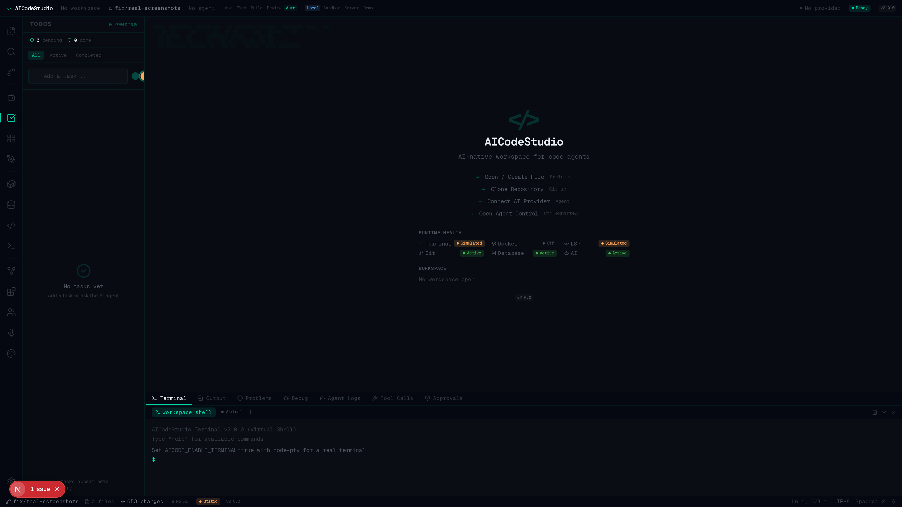</td>
  </tr>
</table>

---

## What is AICodeStudio?

AICodeStudio is an open-source, AI-native IDE designed for code agents. Unlike traditional IDEs that treat AI as an add-on, AICodeStudio puts AI agents at the center of the development experience with a dedicated Agent Control panel, real-time provider status, and an agent-first HUD.

Built with Next.js 16, React 19, and Monaco Editor, it runs entirely in the browser and can be installed as a PWA for a native desktop experience without Electron. The IDE features a professional dark theme with a carefully crafted design token system, ensuring visual consistency across all components.

---

## Agent-first HUD

The HUD (Heads-Up Display) is designed around the agent workflow:

- **Mission Bar** — Shows workspace, git branch, active agent, execution mode (Ask/Plan/Build/Review/Auto), trust mode, and AI provider status at a glance
- **Agent Control Panel** — Dedicated sidebar with agent card, permissions, activity timeline, and quick actions
- **Activity Bar** — Icons organized by group: Workspace, Agents, Runtime, Integrations
- **Status Bar** — Real-time git changes, runtime mode, provider status, and file info
- **Runtime Health** — Visual chips showing which services are active, simulated, or unavailable

---

## Features

### 🤖 AI-Powered Development
- **User-Configurable AI Providers** — Add any AI provider with your own API key; keys are sent only to your instance and are not persisted by default
- **Real AI Chat** — Direct API integration with real AI models through configurable endpoints; no simulated responses or canned fallbacks
- **Connection Testing** — Test your AI provider connection before saving to verify everything works
- **Quick Actions** — One-click AI actions: Explain Code, Find Bugs, Optimize, Review Staged Changes, Create Implementation Plan, Run Tests
- **Markdown Rendering** — AI responses render with full Markdown formatting including code blocks

### 🎤 Voice-to-Code
- **Voice Commands** — Speak natural language commands to create functions, add imports, explain code, find bugs, and refactor
- **Real-Time Transcription** — Live speech-to-text using the Web Speech API with visual waveform feedback
- **Multi-Language Support** — Voice recognition in English, Spanish, French, German, Chinese, and Japanese

### 📝 Professional Code Editor
- **Monaco Editor** — The same editor engine that powers VSCode with IntelliSense, bracket matching, and code folding
- **Configurable Settings** — Font size, tab size, minimap, word wrap, line numbers, ligatures, bracket pairs — all adjustable in real-time
- **Syntax Highlighting** — 20+ languages with custom dark theme optimized for readability
- **Multiple Tabs** — Work with multiple files simultaneously with unsaved change indicators and auto-save

### 📂 Virtual File System
- **Create Files & Folders** — Build your workspace from scratch with real file operations
- **File System Access API** — Open local directories directly in the browser when supported
- **Auto-Save** — Changes are automatically persisted to the virtual file system

### 🐳 Docker Container Management
- **Container Operations** — Start, stop, restart, and remove Docker containers directly from the IDE
- **Security-First** — Docker is disabled by default; requires `AICODE_ENABLE_DOCKER=true` and `DOCKER_HOST` to be explicitly set

### 🗄️ Database Viewer & Editor
- **SQLite Support** — Connect to SQLite databases with full schema browsing and query execution
- **Read-Only by Default** — Only SELECT/WITH/PRAGMA/EXPLAIN are allowed unless `AICODE_DB_WRITE_ENABLED=true`

### 👥 Collaborative Editing (Simulated)
- **Room Management** — Create and join collaboration rooms
- **Experimental** — Real-time sync requires a WebSocket server; currently uses in-memory state

### 🔍 Real Search
- **Search in Files** — Searches through actual file contents in your workspace
- **Regex Support** — Use regular expressions for advanced pattern matching

### 🔗 GitHub Integration
- **Clone Repositories** — Clone any public GitHub repo via the API; files are loaded into your workspace
- **Search GitHub** — Search repositories directly using the GitHub Search API

### 📊 Advanced Git Operations
- **Full Change Tracking** — Stage/unstage individual files, discard changes, view diffs
- **Commit Workflow** — Write commit messages with templates, signed-off-by, and amend support
- **Branch Management** — Create, switch, and delete branches

### 💻 Integrated Terminal
- **Virtual Terminal** — `touch`, `mkdir`, `rm`, `mv`, `cat` operate on the virtual file system
- **Visual Error/Success States** — Command output is color-coded for clarity
- **Real PTY** — Available when `AICODE_ENABLE_TERMINAL=true` with node-pty installed (requires server mode)
- **Labeled Correctly** — Virtual mode is labeled "workspace shell", not "bash"

### 🔧 Language Server Protocol (Simulated)
- **Multi-Language Support** — 10 language configurations
- **Simulated Diagnostics & Completions** — Basic syntax-aware suggestions and diagnostics
- **Real LSP** — Available when `AICODE_ENABLE_LSP=true` with language servers installed (requires server mode)

### 🧩 Extension Marketplace
- **Open VSX Registry** — Browse and install extensions from the Open VSX Registry
- **Full Lifecycle** — Install, uninstall, and toggle extensions

### 🎨 Custom Themes Marketplace
- **Pre-Built Themes** — Nord, Dracula, GitHub Dark, Solarized, Monokai, and Rosé Pine
- **Theme Builder** — Create custom themes with color pickers and live preview

### 🗺️ Canvas Navigation
- **Visual File Graph** — Interactive canvas-based visualization of your workspace files
- **3 Layout Modes** — Tree, Grid, and Force-directed layouts

### 📦 PWA Desktop Installation
- **Install as Desktop App** — Works like a native application on Windows, macOS, and Linux
- **Offline Support** — Service worker caching for core assets
- **Standalone Mode** — No browser chrome; full-screen IDE experience

---

## Real vs Demo/Static

AICodeStudio can run in two modes with different capability levels:

| Feature | Static Demo | Server Mode | Status |
|---------|:-----------:|:-----------:|--------|
| Monaco Editor | Yes | Yes | Real |
| Virtual FS | Yes | Yes | Real |
| AI Chat | If provider set | Yes | Real if provider configured |
| Search in Files | Yes | Yes | Real |
| Extensions | Yes | Yes | Real (Open VSX) |
| Themes | Yes | Yes | Real |
| Docker | No | Optional | Protected by flag |
| Terminal PTY | Virtual only | Optional | Real if `AICODE_ENABLE_TERMINAL=true` |
| LSP | Simulated | Optional | Simulated by default; real if `AICODE_ENABLE_LSP=true` |
| Database | No | SQLite only | Read-only by default |
| Collaboration | No | Simulated | In-memory rooms only |
| Git (server) | No | Yes | Sandboxed to WORKSPACE_DIR |
| File System Access | Yes | Yes | Browser API (when supported) |
| PWA Install | Yes | Yes | Real |

---

## 📥 Installation

### Prerequisites
- **Node.js** 18+ or **Bun** 1.0+
- **npm**, **yarn**, **pnpm**, or **bun**

### Install

```bash
# Clone the repository
git clone https://github.com/smouj/AICodeStudio.git
cd AICodeStudio

# Install dependencies
npm install

# Start development server
npm run dev
```

Open [http://localhost:3000](http://localhost:3000) in your browser.

### Production Build

AICodeStudio supports two deployment modes:

```bash
# Server mode (full IDE with APIs)
npm run build:server
npm start

# Static demo mode (GitHub Pages)
npm run build:static
# Output in out/ directory
```

See [DEPLOYMENT.md](DEPLOYMENT.md) for detailed deployment instructions.

### Install as Desktop App

1. Open AICodeStudio in Chrome, Edge, or any Chromium-based browser
2. Click the **install icon** in the browser address bar
3. Click **Install** — AICodeStudio will launch as a standalone desktop application
4. No Electron needed — it runs as a PWA with native-like performance

---

## Visual System

AICodeStudio uses a centralized design token system for visual consistency:

- **Backgrounds**: Root (#080c12), Base (#050810), Panel (#080c12), Surface (#0a0e14), Elevated (#0d1117)
- **Text hierarchy**: Primary, Secondary, Muted, Dim, Disabled — ensuring proper contrast at every level
- **Accent**: Teal (#00d4aa) used sparingly for agent/active states only
- **Semantic colors**: Success (green), Warning (amber), Danger (red), Info (blue)
- **Radius**: 2–4px consistently across all components
- **Shadows**: Minimal, functional shadows without glow effects

The design avoids:
- Excessive glows or neon effects
- Generic SaaS aesthetics
- Poor contrast or illegible text
- Overuse of teal accent color
- Inconsistent rounded corners

---

## Brand Assets

Brand assets are located in `public/brand/`:

- `aicodestudio-logo.svg` — Full logo with background
- `aicodestudio-mark.svg` — Icon-only mark
- `aicodestudio-logo-dark.svg` — Logo variant for dark surfaces
- `aicodestudio-social-banner.svg` — Social media banner

Screenshots are in `public/screenshots/`.

---

## Runtime Capabilities

Runtime capabilities are determined by server flags and environment:

| Flag | Effect |
|------|--------|
| `AICODE_ENABLE_DOCKER=true` | Enable Docker container management |
| `AICODE_ENABLE_TERMINAL=true` | Enable real PTY terminal (requires node-pty) |
| `AICODE_ENABLE_LSP=true` | Enable real LSP integration |
| `AICODE_DB_WRITE_ENABLED=true` | Allow write operations on databases |
| `DOCKER_HOST` | Docker daemon address (required with Docker flag) |
| `WORKSPACE_DIR` | Git sandbox directory |

---

## ⌨️ Keyboard Shortcuts

| Shortcut | Action |
|---|---|
| `Ctrl+Shift+P` | Open Command Palette |
| `Ctrl+Shift+F` | Search in Files |
| `Ctrl+Shift+G` | Source Control |
| `Ctrl+Shift+A` | AI Assistant |
| `Ctrl+Shift+X` | Extensions |
| `Ctrl+\`` | Toggle Terminal |
| `Ctrl+,` | Open Settings |
| `Ctrl+T` | Toggle Theme |
| `Ctrl+Enter` | Execute Query (Database) |

---

## 🏗️ Architecture

```
src/
├── app/
│   ├── api/           # API routes (ai, git, docker, database, etc.)
│   ├── globals.css    # Global styles & design tokens
│   ├── layout.tsx     # Root layout with PWA metadata
│   └── page.tsx       # Main entry point
├── components/
│   ├── hud/           # Design tokens & HUD primitives
│   ├── ide/           # IDE components
│   └── ui/            # shadcn/ui component library
├── store/             # Zustand global state
├── lib/               # Utilities, security, server flags
```

---

## 🛠️ Tech Stack

| Technology | Purpose |
|---|---|
| [Next.js 16](https://nextjs.org/) | React framework with App Router |
| [React 19](https://react.dev/) | UI library with compiler |
| [TypeScript 5](https://www.typescriptlang.org/) | Type-safe development |
| [Monaco Editor](https://microsoft.github.io/monaco-editor/) | VSCode's editor engine |
| [Zustand](https://zustand.docs.pmnd.rs/) | Lightweight state management |
| [Tailwind CSS 4](https://tailwindcss.com/) | Utility-first styling |
| [shadcn/ui](https://ui.shadcn.com/) | Accessible UI components |
| [Lucide Icons](https://lucide.dev/) | Consistent icon set |
| [Yjs](https://yjs.dev/) | CRDT-based real-time collaboration |
| [Open VSX](https://open-vsx.org/) | Extension marketplace registry |
| [PWA](https://web.dev/progressive-web-apps/) | Desktop installation support |
| [Prisma](https://www.prisma.io/) | Database ORM |
| [isomorphic-git](https://isomorphic-git.org/) | Browser Git operations |

---

## 🎯 Roadmap

- [x] Virtual file system with real file operations
- [x] Real search across file contents
- [x] User-configurable AI providers with real API calls
- [x] GitHub API integration for clone/search/trending
- [x] Git staging and commit workflow (server mode)
- [x] Virtual terminal with file system commands
- [x] Agent-first HUD with Mission Bar and Agent Control
- [x] Centralized design token system
- [x] Extension marketplace (Open VSX)
- [x] Docker container management (requires explicit opt-in)
- [x] SQLite database viewer and query editor
- [x] Custom themes marketplace with theme builder
- [x] Voice-to-code AI integration
- [x] Canvas navigation for visual file graphs
- [x] PWA desktop installation
- [x] Security hardening (path sandboxing, SQL guard, secret protection)
- [x] File System Access API for local files
- [x] Real PTY terminal over WebSocket
- [x] Canvas-based real-time collaborative whiteboard
- [ ] Real-time collaboration via WebSocket (Yjs)
- [ ] Real LSP integration for TypeScript/JavaScript
- [ ] Multi-database adapters (PostgreSQL, MySQL, MongoDB)

---

## 📊 Feature Status

| Feature | Static Demo | Server Mode | Status |
|---------|:-----------:|:-----------:|--------|
| Monaco Editor | Yes | Yes | Real |
| Virtual FS | Yes | Yes | Real |
| AI Chat | If provider set | Yes | Real if provider configured |
| Search in Files | Yes | Yes | Real |
| Extensions | Yes | Yes | Real (Open VSX) |
| Themes | Yes | Yes | Real |
| Docker | No | Optional | Protected by flag |
| Terminal PTY | Virtual only | Optional | Real if `AICODE_ENABLE_TERMINAL=true` |
| LSP | Simulated | Optional | Simulated by default; real if `AICODE_ENABLE_LSP=true` |
| Database | No | SQLite only | Read-only by default |
| Collaboration | No | Simulated | In-memory rooms only |
| Git (server) | No | Yes | Sandboxed to WORKSPACE_DIR |
| File System Access | Yes | Yes | Browser API (when supported) |
| PWA Install | Yes | Yes | Real |

---

## 🤝 Contributing

Contributions are welcome! Please feel free to submit a Pull Request.

1. **Fork** the repository
2. **Create** your feature branch (`git checkout -b feature/amazing-feature`)
3. **Commit** your changes (`git commit -m 'Add amazing feature'`)
4. **Push** to the branch (`git push origin feature/amazing-feature`)
5. **Open** a Pull Request

See [CONTRIBUTING.md](CONTRIBUTING.md) for detailed guidelines.

---

## 📄 License

This project is licensed under the MIT License — see the [LICENSE](LICENSE) file for details.

---

<div align="center">

**Built with care by the AICodeStudio Team**

[⬆ Back to Top](#aicodestudio)

</div>
